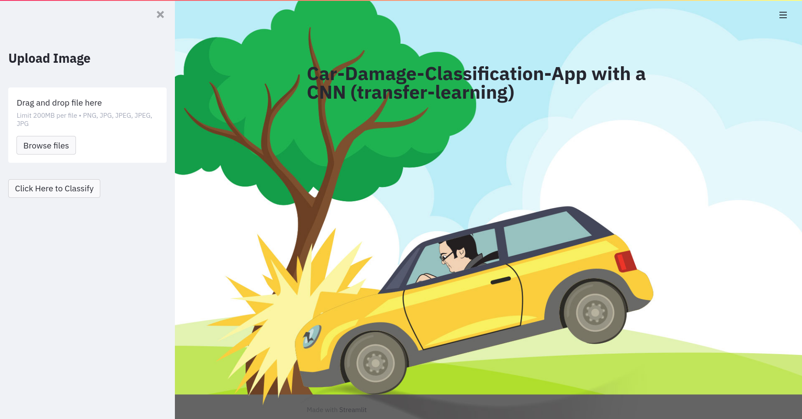

# Car-Demage-Detection
car-damage classification model for car insurences

### General info
This project is about a car-damage classification model for a car insurence to simplify the regulation process with cnn (mobilenet). The hole model-pipeline consits of 3 different models. 
- model one recognizes if your uploaded picture shows a car-damage or not
- model two recognizes the location of the damage on your car (only 3 options are available)
- model three recognizes the severity of the damage

all in all the model has an accuracy of 75% which is ok

### Requirements
- Python 3.8
- Tensorflow 2.6
- Streamlit 1.0

### Setup
- download/clone the repo
- open your terminal in the repo-folder
- type ***streamlit run streamlit_app.py*** in the opened terminal
